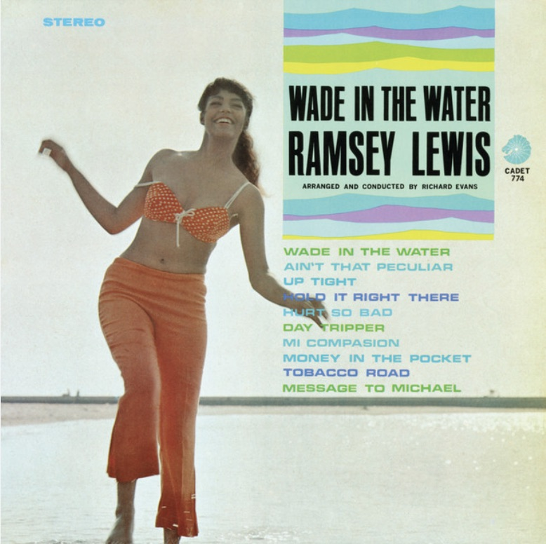

```{r}

```

{width="50%" fig-align="left"}

::: column-margin
Ramsey Lewis album cover
:::

```{r}
#| echo: false
#| eval: true

html_tag_audio <- function(file, type = c("wav")) {
  type <- match.arg(type)
  htmltools::tags$audio(
    controls = "",
    htmltools::tags$source(
      src = file,
      type = glue::glue("audio/{type}", type = type)
    )
  )
}

```

Some notes from a Saturday Jam.

1.  Decided to try out Ableton 12's stem separation feature. Nice to have this in Ableton. Decent enough for my purposes.

2.  Grabbed a bunch of Ramsey Lewis tunes, split out the drums

3.  Loaded a sample of drums from Lewis's Day Tripper track into the m8

4.  Messed around on the piano recording various parts

Really enjoying the M8 for "note taking", and recording samples while playing over some beats.

The example here features the drum section mentioned above and a 20 bar track with a piano bass line that repeats. The third track (on the m8) is a very long jam track. Here, I used the m8 sampler to play over the 20 bar chord changes, something like 19 times. It's just a single wav file, but it's easy to slice it up into 20 bar units, which provides similar functionality to take lanes (say in Ableton).

A neat feature of the m8 is that it is also fairly straightforward to replay the whole thing, and randomly set the slice that gets played for any 20 bar phrase (endless jazzzzzz). I didn't do that here, but I did choose a few of the 19 takes to render (just three or four).

Lot's of roughness around the edges. Will likely use stuff here as a base of inspiration for something else...starting with playing the whole bass line so it is more responsive to the other parts.

`r html_tag_audio("RL2_01.mp3", type = "wav")`
