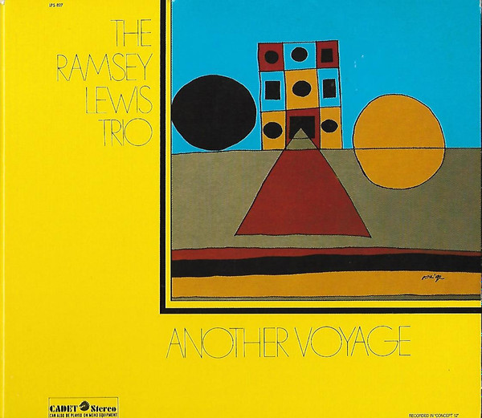

```{r}

```

{width="50%" fig-align="left"}

::: column-margin
Ramsey Lewis album cover
:::

```{r}
#| echo: false
#| eval: true

html_tag_audio <- function(file, type = c("wav")) {
  type <- match.arg(type)
  htmltools::tags$audio(
    controls = "",
    htmltools::tags$source(
      src = file,
      type = glue::glue("audio/{type}", type = type)
    )
  )
}

```

Notes on working another riff. 

1. Sampled "Do What You Wanna" from the Ramsey Lewis Trio's Another Voyage, used Ableton's stem extraction to get this beat:

`r html_tag_audio("RL_DWYW_1115.wav", type = "wav")`

2. Used the m8 to slice the beat and shuffle it up a bit, used this version as the base to jam over.

3. Added some simple piano chords, bass line and piano lead melody. All recorded with the m8. The melody was a long jam, which was reviewed and then a small 8 bar selection was chosen to be "the melody" (it's repeated twice at the front of the next clip. 

I had some larger goals for the next steps, but haven't completed them all for this riff. One larger goal was to extend beyond this 8 bar melody to something like a 12 or 16 or bar first section, followed by a different middle section, that links back into the first section.

I didn't get that far. Instead, after establishing some backing tracks for the main melody, I just jammed over them on piano playing new melody style lead line variations. I was going to use these variations to explore additional chord changes throughout the middle, but haven't got there yet. But, jamming out the variations was lots of fun. 

4. I imported the piano lead line variations into Ableton and converted them to midi. Then, added some synth horn layering in the clip below. 

5. Fiddled around a bit with levels and mixing. Converted the drum beat to midi, did a bit of variation on the drums, but not enough. 

6. The result is a 2 minute bouncy major thing. I like the direction of the melody lines. The drums are too repetitive and get a bit cludgy with the bass line. Once I've locked in the actual song structure, will need to re-record the backing tracks as full-length tracks so they are "live" rather than loops that keep repeating and get old. Bouncing everything out as I go and listening to it on different headphones and speakers makes me think I'll never get the mix right, but it's fun to try.


`r html_tag_audio("RL3_take_2.mp3", type = "wav")`

----------------

9/14/25

Some edits were made.

1. Got rid of several of the repetitive loop aspects

2. Added new piano chords and bass line throughout the middle section

3. Added some op-xy finger drumming throughout, mixed this in and out of the sampled beat. Some heavier FX on the drums to bring it together

4. Added a guitar part over some of the melody

5. Took more time to attempt to balance volume levels throughout and then get a final mix that sounds decent across headphone/speaker variations. This always takes forever. Something is probably too loud or not loud enough.

When adding new parts, used ableton take a lanes a whole lot, worked incrementally through 4 to 8 bar sections. 

`r html_tag_audio("RL3_take_5.mp3", type = "wav")`
